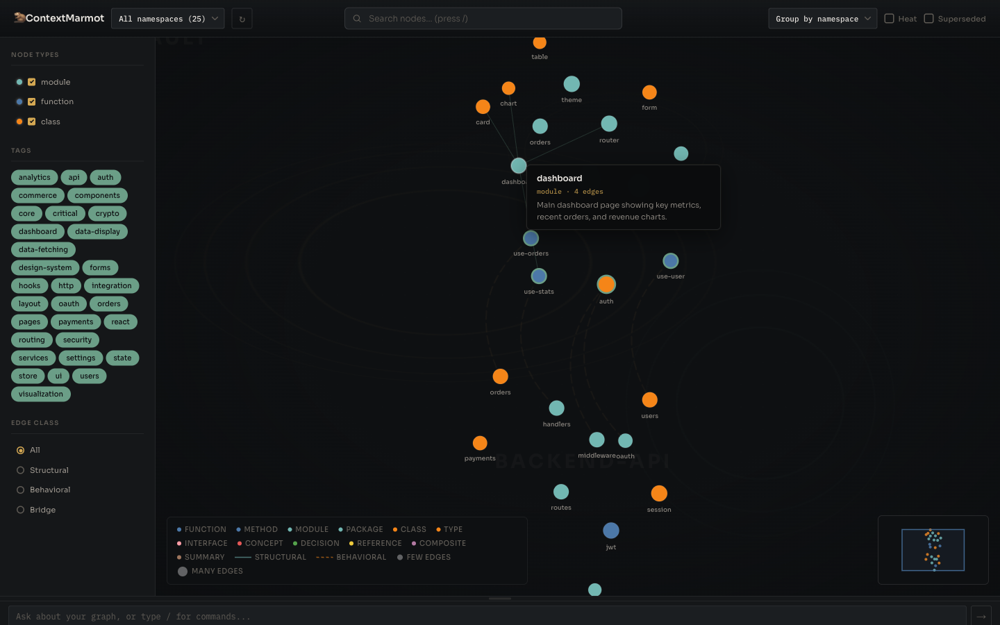
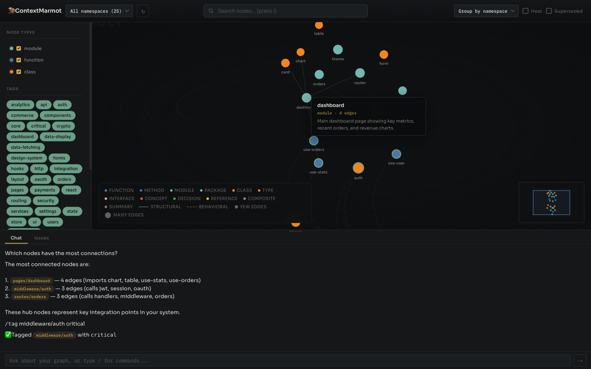
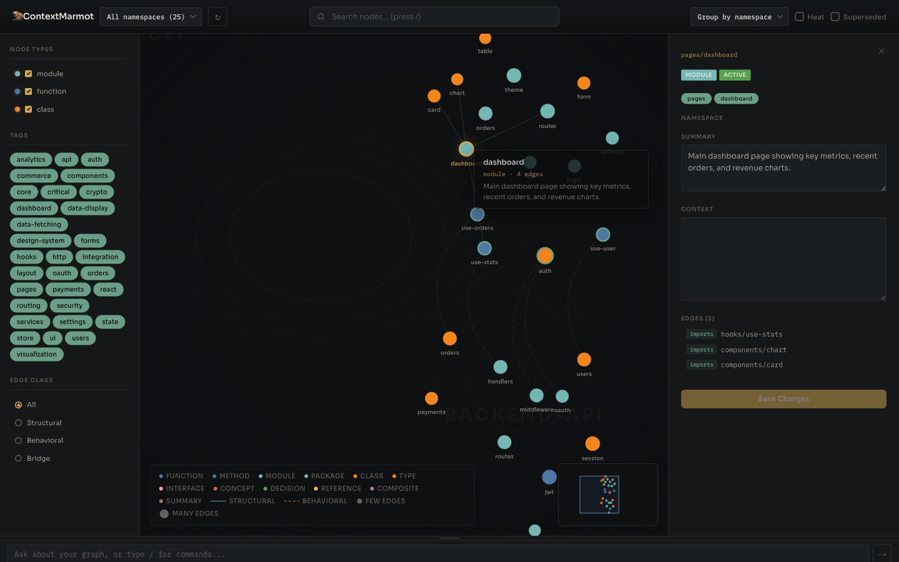
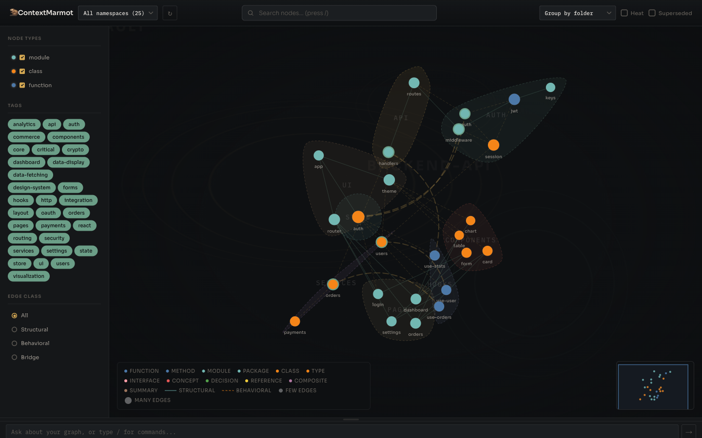

<p align="center">
  
</p>

<h1 align="center">
  
  ContextMarmot
</h1>

<p align="center">A graph-based memory engine for agentic systems.</p> Agents query and write to a persistent knowledge graph via [MCP](https://modelcontextprotocol.io/), getting structured context instead of reading raw files.

```
Agent  -->  MCP Server  -->  Embed + Search + Traverse + Compact  -->  XML context
```

Nodes are Obsidian-compatible markdown files with YAML frontmatter and `[[wikilinks]]`. Open the vault in Obsidian or use the built-in web UI for graph visualization.

---

## Screenshots

<table>
<tr>
<td width="50%">

<p align="center"><em>Multi-namespace graph with bridge arcs</em></p>
</td>
<td width="50%">

<p align="center"><em>Chat-driven graph curation</em></p>
</td>
</tr>
<tr>
<td width="50%">

<p align="center"><em>Node detail panel with edges, tags, and summary</em></p>
</td>
<td width="50%">

<p align="center"><em>Folder grouping with organic contour hulls</em></p>
</td>
</tr>
</table>

---

## Features

- **Graph-based context** --- nodes connected by typed, directed edges (structural and behavioral)
- **Structural acyclicity** --- DAG-enforced for `contains`, `imports`, `extends`, `implements`; cycles allowed for behavioral edges
- **Semantic search** --- embedding index for natural language queries with graph traversal expansion
- **Token-budget compaction** --- results fit your context window, with full/compact/truncated tiers
- **MCP server** --- 5 tools over stdio (`context_query`, `context_write`, `context_tag`, `context_verify`, `context_delete`)
- **CRUD classifier** --- auto-classifies writes as ADD/UPDATE/SUPERSEDE/NOOP using embeddings + optional LLM
- **Multi-namespace** --- project isolation with bridge manifests for cross-namespace and cross-vault edges
- **Domain tags** --- many-to-many semantic categorization; bulk-tag via search query; graph clustering by tag
- **Static analysis indexer** --- parses Go (full AST), TypeScript, and 30+ languages into graph nodes with typed edges
- **Graph visualization** --- embedded D3 web UI with filters, search, heat overlay, folder grouping, and bridge arcs
- **Graph Curator** --- chat-driven curation UI with NL queries, slash commands, and node-ref pills
- **Summary engine** --- auto-generates namespace summaries via LLM; regenerates on significant changes
- **Heat map** --- co-access frequency tracking with exponential decay; hot edges get traversal priority
- **Integrity verification** --- hash-based staleness detection, dangling edge checks, cycle detection
- **Single binary** --- Go, zero CGo, zero runtime dependencies

## Quick Start

### Prerequisites

- Go 1.21+ (`brew install go` or [go.dev/dl](https://go.dev/dl/))
- Node.js 20.19+ (or 22.12+) only if building/running the web UI (`marmot ui`)
- (Optional) An [OpenAI API key](https://platform.openai.com/api-keys) for semantic search. Without one, the mock embedder provides lexical-overlap search.

### Build

```bash
git clone https://github.com/nurozen/context-marmot.git
cd context-marmot
make build
```

This produces `bin/marmot`.

If you also want the embedded web UI:

```bash
make build-full
```

### Try the demo

```bash
# Seed a demo vault with 8 nodes (auth + database graph)
cd testdata/demo
bash seed.sh

# Index nodes into the embedding store
../../bin/marmot index --dir .marmot

# Query the graph
../../bin/marmot query --dir .marmot --query "user authentication login"

# Verify integrity
../../bin/marmot verify --dir .marmot

# Launch graph UI
../../bin/marmot ui --dir .marmot --no-open

# Open in Obsidian (optional --- open testdata/demo/.marmot as a vault)
```

Then open [http://localhost:3274](http://localhost:3274).

### Use in your own project

```bash
cd your-project

# Initialize vault, configure embeddings, and set up MCP configs --- all in one step
marmot init
```

`marmot init` runs three stages:
1. Creates the `.marmot/` vault directory
2. **`configure`** --- prompts for embedding provider, model, API key, and CRUD classifier (provider + model)
3. **`setup`** --- detects your tools (Claude Code, Codex, VS Code, Cursor) and writes MCP configs

After init, index your source code:

```bash
marmot index
```

Agents automatically connect to the MCP server --- no manual server start needed.

### Manual setup (if needed)

Run `marmot configure` or `marmot setup` individually at any time:

```bash
# Re-configure embedding provider/model/key
marmot configure

# Regenerate MCP configs (e.g., after installing a new tool)
marmot setup

# Target a specific tool
marmot setup --claude
marmot setup --codex
marmot setup --vscode
marmot setup --cursor
```

## MCP Tools

Once connected, agents get five tools:

| Tool | Description |
|------|-------------|
| `context_query` | Search the graph by natural language. Returns XML-compacted subgraph within token budget. |
| `context_write` | Write or update a node. Enforces structural acyclicity. Updates embedding index. Accepts optional `tags`. |
| `context_tag` | Bulk-tag nodes by semantic search query. Finds nodes matching a query and applies the given tags. |
| `context_verify` | Check node staleness, dangling edges, and structural integrity. |
| `context_delete` | Soft-delete (supersede) a node. Excluded from future queries by default. |

## CLI Reference

| Command | Description |
|---------|-------------|
| `marmot init [--dir .marmot]` | Create a new vault, run configure, then setup |
| `marmot configure [--dir .marmot]` | Interactive prompt for embedding provider, model, API key, and CRUD classifier |
| `marmot setup [--dir .marmot] [--claude] [--codex] [--vscode] [--cursor]` | Generate MCP configs for detected (or specified) tools |
| `marmot index [--dir .marmot] [--force] [<path>] [--incremental]` | Index node files or run static analysis on source code. `--force` rebuilds all embeddings. |
| `marmot query --query "..." [--dir .marmot] [--depth 2] [--budget 4096]` | Query the knowledge graph |
| `marmot verify [--dir .marmot]` | Run integrity and staleness checks |
| `marmot serve [--dir .marmot]` | Start the MCP server on stdio |
| `marmot status [--dir .marmot]` | Show vault stats: node counts, edges, embeddings, namespaces, heat map |
| `marmot watch [--dir .marmot]` | Start file watcher for auto-reindex on source changes |
| `marmot bridge <ns-a> <ns-b> [--relations ...]` | Create bridge manifest between two namespaces |
| `marmot summarize [--namespace ...]` | Force summary regeneration for a namespace |
| `marmot reembed [--dir .marmot]` | Regenerate all embeddings (use after changing provider/model) |
| `marmot sdk [--out ./marmot-sdk.ts]` | Generate a type-safe TypeScript SDK from MCP tool schemas |
| `marmot ui [--dir .marmot] [--port 3274] [--no-open]` | Start the embedded graph visualization UI |

## Architecture

```
cmd/marmot/              CLI (init, configure, setup, index, query, serve, verify)
internal/
  config/                Vault config, .env key storage, embedder + classifier factory
  node/                  Markdown parser/writer, atomic file I/O, temporal fields
  graph/                 In-memory graph, adjacency lists, cycle detection
  verify/                Hash integrity, staleness, structural checks
  embedding/             SQLite store, KNN search, OpenAI + mock embedders
  traversal/             BFS traversal, token-budget XML compaction
  llm/                   LLM provider interface (OpenAI, Anthropic, mock)
  classifier/            CRUD classifier: embedding + LLM + distance fallback
  namespace/             Namespace manager, bridge manifests, qualified ID resolution
  summary/               Namespace summary generation, async scheduler
  update/                Source change detection, staleness propagation, file watcher
  indexer/               Static analysis: Go AST, TypeScript regex, generic, runner
  mcp/                   MCP server (5 tools), engine wiring
```

See [docs/architecture.md](docs/architecture.md) for the full system design.

## Current Status

**MVP complete.** Evaluated on [SWE-QA](https://huggingface.co/datasets/swe-qa/SWE-QA-Benchmark) --- 20 code comprehension questions across django, flask, pytest, and requests:

| Metric | Vanilla (file tools) | Hybrid (ContextMarmot) | Improvement |
|--------|---------------------|----------------------|-------------|
| Answer quality (1-5) | 4.62 | 4.62 | **identical** |
| Tokens per question | 151,327 | 95,876 | **-37%** |
| Cost per question | $0.1065 | $0.0834 | **-22%** |
| Avg turns | 7.5 | 6.9 | -8% |

Same quality. Lower cost. The graph acts as a navigation map --- agents query it first, then read only the files and line ranges it identifies, skipping broad exploration.

See [docs/benchmark.md](docs/benchmark.md) for the full per-question breakdown and methodology.

### Known MVP limitations

- **Go-side KNN** --- search scans all embeddings in Go. Fine for thousands of nodes; would need sqlite-vec for 100k+.
- **Limited provider selection** --- OpenAI and mock are supported. Voyage AI, Ollama, and other providers are not yet available.

### Post-MVP roadmap

See [docs/implementation_plan.md](docs/implementation_plan.md) for the full plan and phase status.

## Documentation

| Document | Description |
|----------|-------------|
| [Architecture](docs/architecture.md) | Full system design and component interactions |
| [Bridges](docs/bridges.md) | Namespace and cross-vault bridge configuration |
| [Embedding Providers](docs/embedding-providers.md) | Embedding provider setup and fallback behavior |
| [CRUD Classifier](docs/crud-classifier.md) | Write classification (ADD/UPDATE/SUPERSEDE/NOOP) |
| [TypeScript SDK](docs/typescript-sdk.md) | Type-safe SDK generation and usage |
| [Development](docs/development.md) | Build commands, node format, and edge types |
| [Benchmark](docs/benchmark.md) | SWE-QA evaluation methodology and results |
| [Data Structures](docs/data-structures.md) | Node, edge, and vault format specifications |
| [Implementation Plan](docs/implementation_plan.md) | Full roadmap with phase status |

## License

Apache 2.0 --- see [LICENSE](LICENSE).
