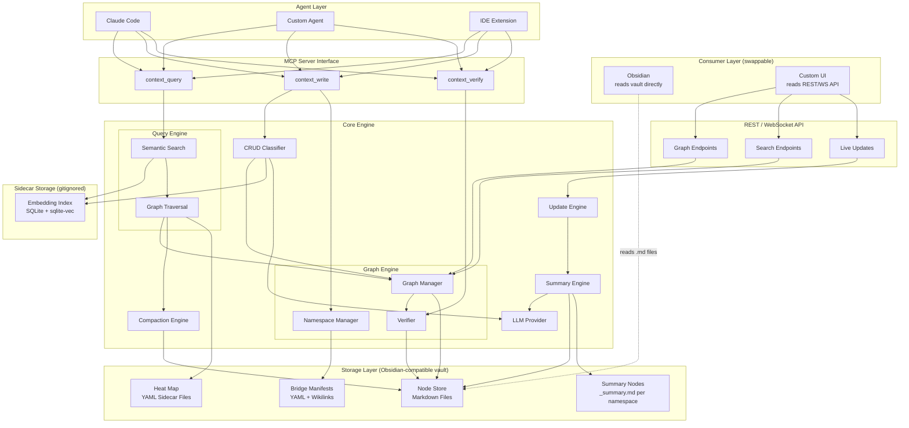
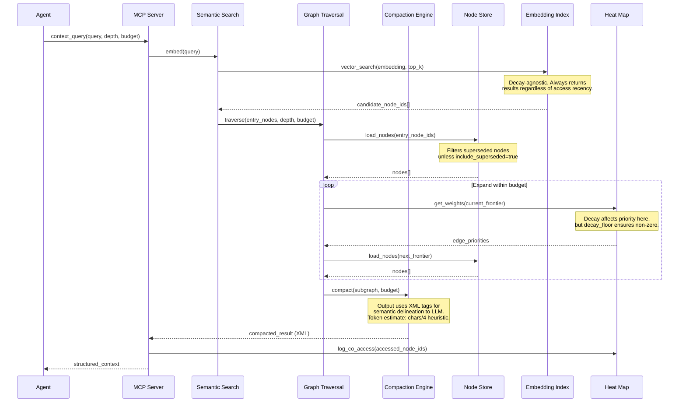
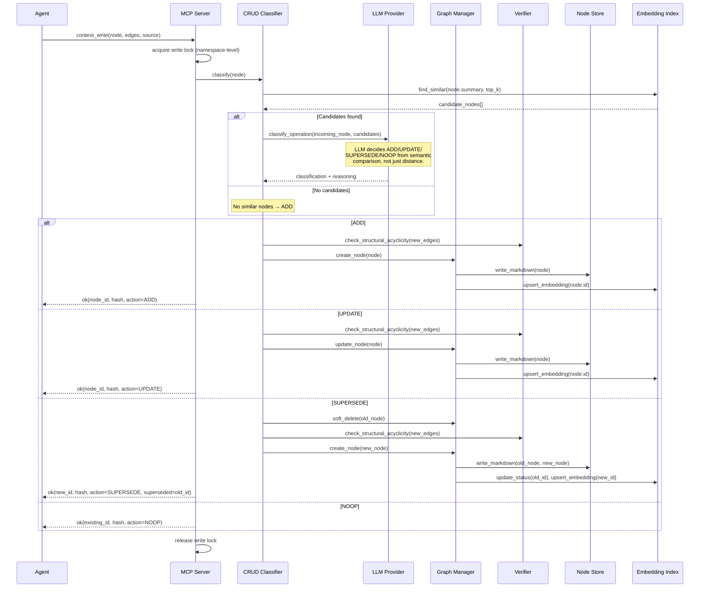

# ContextMarmot Architecture

## System Overview



## Consumer Abstraction

ContextMarmot separates data from presentation. The vault is the source of truth;
consumers are swappable frontends that read it in different ways.

| Consumer | How it reads | When to use |
|----------|-------------|-------------|
| **Obsidian** | Opens `.marmot/` as a vault. Sees wikilinks, renders graph view, backlinks, search. Zero integration. | Default. Free visualization from day one. |
| **Custom UI** | Hits REST/WebSocket API served by `marmot serve`. Gets structured JSON. | When you outgrow Obsidian or need agent-specific views. |
| **Agents (MCP)** | Calls `context_query` / `context_write` / `context_verify`. Gets XML-structured compacted output. | Primary programmatic interface. |
| **CLI** | Runs `marmot` commands. Gets text output. | Scripting, CI/CD, manual operations. |

The core engine never depends on any consumer. Obsidian compatibility is a property
of the file format, not an integration.

## Format Strategy

| Location | Format | Why |
|----------|--------|-----|
| **Node files (on disk)** | YAML frontmatter + Markdown body + `[[wikilinks]]` | Human-readable, Obsidian-compatible, git-friendly diffs |
| **Config / Heat map / Bridges (on disk)** | YAML frontmatter + Markdown body | Consistent with node format, human-editable |
| **Compacted output (to agents)** | XML tags | Semantic delineation for LLMs — avoids ambiguity in model context window |
| **REST API (to custom UI)** | JSON | Standard web API format |

## Edge Classification

Edges are split into two classes with different constraint rules. Real code has
mutual recursion, circular imports, and bidirectional dependencies — a strict DAG
cannot represent these. Only structural/hierarchical edges enforce acyclicity.

| Class | Relations | Cycles allowed? | Purpose |
|-------|-----------|----------------|---------|
| **Structural** | `contains`, `imports`, `extends`, `implements` | **No** — acyclicity enforced | Hierarchy, module structure, type system. These form the tree/DAG backbone of the graph. |
| **Behavioral** | `calls`, `reads`, `writes`, `references`, `cross_project`, `associated` | **Yes** — cycles allowed | Runtime behavior, data flow, loose associations. `A calls B, B calls A` is valid. |

The verifier only checks acyclicity on structural edges. Behavioral edges can form
arbitrary directed graphs, including cycles. This matches real code: a module hierarchy
is acyclic, but call graphs are not.

Traversal uses structural edges for hierarchical expansion and behavioral edges for
contextual breadth. Compaction prefers structural paths for the "spine" of the result.

## Graph Consistency Model

The graph is **eventually consistent**, not real-time. Between a source file edit
and re-indexing, the graph may contain stale information. This is an inherent tradeoff
of pre-computed context.

**Mitigation strategy:**
- The graph tells agents *where to look* and *how things connect* — it's a map, not the territory.
- Hard references in compacted output (`<source path="..." />`) always point to the actual source file.
- Agents should trust the graph for **structure** (what calls what) and **verify content** by reading the source file via `read_file()` when precision matters.
- `context_verify` lets agents check staleness before acting on graph content.
- File watcher mode minimizes the stale window in active development.

## Query Flow



## Write Flow



## Concurrency Model

Multiple agents or processes may read and write to the graph simultaneously.

### Read Path (No Locking)

Reads are lock-free. The in-memory graph is built at startup and updated on write.
Multiple concurrent reads are safe — they see a consistent snapshot.

### Write Path (Namespace-Level Locking)

Writes acquire a **namespace-level mutex** before modifying any node within that
namespace. This prevents:
- Two agents creating duplicate nodes simultaneously (CRUD race condition)
- Concurrent writes to the same node file (file corruption)
- Inconsistent in-memory graph state during multi-step operations (supersede = delete + create)

Writes to *different* namespaces proceed in parallel with no contention.

### File-Level Safety

Node files are written atomically: write to a temp file, then rename. This prevents
partial reads if a reader accesses a file mid-write.

### Git

ContextMarmot does not auto-commit to git. The supersede chain (Phase 8) provides semantic history — intentional node replacements with `valid_from`/`valid_until` timestamps and `superseded_by` links — which covers the meaningful history an agent system needs. Users manage `.marmot/` in their project's git the same way they manage any other directory.

## LLM Provider

The engine has an explicit LLM dependency for two subsystems:

| Subsystem | Uses LLM for | Fallback if unavailable |
|-----------|-------------|------------------------|
| **CRUD Classifier** | Semantic classification of ADD/UPDATE/SUPERSEDE/NOOP from candidate nodes | Falls back to pure embedding distance (less accurate but functional) |
| **Summary Engine** | Synthesizing `_summary.md` from namespace nodes | Summaries go stale; not regenerated until LLM is available |

### Configuration

```yaml
# In _config.md frontmatter:
classifier_provider: openai           # openai | anthropic | none
classifier_model: gpt-5.1-codex-mini  # model name; set by marmot configure
```

The LLM provider is abstracted behind an interface. The CRUD classifier and summary
engine work with any provider. Haiku-class models are sufficient for both tasks —
classification is a structured output call, not creative generation.

## Token Budget Estimation

The compaction engine and traversal engine estimate token counts using:

```
estimated_tokens = len(content_bytes) / 4
```

This `chars/4` heuristic is within 10-20% for English and code, which is sufficient
for budget allocation (not billing). The estimate includes XML overhead from the
compacted output format.

If precision becomes critical, a proper tokenizer can be plugged in via the
`TokenEstimator` interface. The heuristic is the default.

## Embedding Model Management

Embeddings are not portable across models. The system tracks which model generated
each embedding to prevent cross-model similarity comparisons.

- Each namespace config specifies its `embedding_model`.
- The embedding index stores `model` alongside each embedding.
- `search()` and `find_similar()` reject queries if the query embedding model
  doesn't match the stored embeddings.
- `marmot reembed --namespace <ns>` regenerates all embeddings for a namespace
  (required after changing `embedding_model` in config).
- Different namespaces can use different models — cross-namespace search goes
  through bridge edges, not cross-model similarity.

## Directory Layout

The `.marmot/` directory IS an Obsidian-compatible vault. Opening it in Obsidian
gives you graph visualization, backlinks, and search for free.

```
.marmot/                              # Obsidian-compatible vault root
├── .obsidian/                        # Obsidian config (auto-generated, gitignored)
│
├── _config.md                        # Global configuration
│
├── project-alpha/                    # Namespace = folder (visible in Obsidian)
│   ├── _namespace.md                 # Namespace metadata
│   ├── _summary.md                   # Auto-generated namespace summary
│   ├── auth/
│   │   ├── login.md                  # Node: auth/login (status: active)
│   │   ├── login_v1.md               # Node: auth/login_v1 (status: superseded)
│   │   └── validate_token.md         # Node: auth/validate_token
│   └── db/
│       └── users/
│           └── find.md               # Node: db/users/find
│
├── project-beta/                     # Another namespace
│   ├── _namespace.md
│   ├── _summary.md
│   └── api/
│       └── session.md                # Node: api/session
│
├── _bridges/
│   └── project-alpha--project-beta.md  # Allowed relations only; edge list auto-derived
│
├── _heat/                            # Heat map sidecars
│   ├── project-alpha.md
│   └── project-beta.md
│
└── .marmot-data/                     # Binary sidecar (gitignored)
    ├── project-alpha/
    │   └── embeddings.db             # SQLite + sqlite-vec
    └── project-beta/
        └── embeddings.db
```

**Conventions:**
- `_` prefix on system files — sorts to top, visually distinct from content nodes in Obsidian.
- Namespace = top-level folder. Nodes live directly in namespace folders (no `nodes/` subdirectory) so Obsidian graph shows clean structure.
- `.marmot-data/` for binary files — gitignored AND excluded from Obsidian indexing via `.obsidian/app.json`.
- `.obsidian/` is auto-generated and gitignored. Users can customize their own Obsidian settings without affecting the project.
- Superseded nodes remain on disk with `status: superseded` in frontmatter. Visible in Obsidian, excluded from queries by default.

## Component Responsibilities

| Component | Responsibility |
|-----------|---------------|
| **MCP Server** | Tool interface for agents. Exposes `context_query`, `context_write`, `context_verify`. Routes requests, logs co-access. Manages namespace write locks. |
| **REST/WS API** | HTTP + WebSocket interface for custom UIs. Serves graph data as JSON. Pushes live updates via WebSocket. |
| **LLM Provider** | Abstracted interface for LLM calls. Used by CRUD Classifier (semantic classification) and Summary Engine (synthesis). Falls back gracefully when unavailable. |
| **CRUD Classifier** | On write: embeds incoming node, retrieves similar candidates from embedding index, then uses LLM to classify as ADD/UPDATE/SUPERSEDE/NOOP. Falls back to embedding distance if LLM unavailable. |
| **Semantic Search** | Embeds queries, performs vector similarity search against embedding index (decay-agnostic). Returns ranked candidate node IDs as traversal entry points. |
| **Graph Traversal** | BFS/DFS expansion from entry nodes. Respects depth limits and token budgets. Uses heat map weights (with decay floor) to prioritize edges when budget-constrained. Follows both structural and behavioral edges. |
| **Compaction Engine** | Takes a raw subgraph and compacts it to fit a token budget (estimated via chars/4 heuristic). Produces XML-structured output for LLM consumption. Adjacency compaction merges nearby nodes with hard references. |
| **Graph Manager** | Core graph operations: add/remove/update/soft-delete nodes and edges. Maintains in-memory adjacency list. Enforces structural acyclicity (behavioral cycles allowed). Atomic file writes. |
| **Verifier** | Structural acyclicity enforcement (topological sort on structural edges only). Content hash computation. Staleness detection via source hash comparison. Behavioral edges skip cycle checks. |
| **Namespace Manager** | Project isolation. Resolves qualified cross-namespace references. Manages bridge manifests (allowed_relations whitelist). |
| **Update Engine** | Hash-based change detection. Compares stored source hashes to current file state. Propagates staleness flags to dependent nodes. Pushes changes via WebSocket. Triggers summary regeneration. |
| **Summary Engine** | Async generation of `_summary.md` per namespace. Uses LLM Provider to synthesize from active nodes. Runs outside the critical path. Degrades gracefully (goes stale, not broken). |
| **Node Store** | File I/O layer. Reads/writes markdown node files. Parses YAML frontmatter (including temporal fields) + wikilinks + markdown sections. Atomic writes via temp-file-then-rename. |
| **Embedding Index** | SQLite + sqlite-vec. Stores node ID -> embedding + model tag. Decay-agnostic. Supports similarity search for CRUD classification. Rejects cross-model queries. |
| **Heat Map** | Per-namespace co-access frequency store. Exponential decay with floor (never reaches zero). Informs traversal prioritization only — never affects discoverability. |
| **Git Layer** | Not used. ContextMarmot does not auto-commit. The supersede chain provides semantic history. Users manage `.marmot/` in git like any other directory. |

## Decay Model

Decay is scoped carefully to avoid hiding useful-but-old content.

| Layer | Decays? | Effect of decay | Safeguard |
|-------|---------|-----------------|-----------|
| **Node files** | Never | Always exist, always readable | — |
| **Embedding index** | Never | Always discoverable by semantic search | — |
| **Heat map (co-access pairs)** | Yes | Reduces traversal priority when budget-constrained | `decay_floor` ensures non-zero weight |
| **Node status** | Never auto-decays | Nodes stay `active` until explicitly superseded | Manual or CRUD-classifier driven |

Old, untouched code modules remain fully discoverable via direct query or semantic
search. They won't appear as *bonus context* alongside actively-used nodes, but a
direct query about that module works immediately. First access reactivates heat map
weights instantly.

## Competitive Context

| Alternative | What it does | Gap ContextMarmot fills |
|-------------|-------------|------------------------|
| **CLAUDE.md / memory files** | Flat text, no relationships, no traversal, no cross-project linking | Structured graph with typed edges, semantic search, compaction |
| **Neo4j + Obsidian plugin** | Heavyweight graph DB, not human-editable, requires running server | File-based, human-readable, zero-dependency visualization via Obsidian |
| **Cursor / Cody codebase indexing** | Code-specific, single-project, no persistent relationships, no agent write-back | Multi-project, persistent typed relationships, agents write knowledge back |
| **Simple context.xml per project** | Static, manually authored, no graph structure, no search | Dynamic, auto-indexed, graph traversal, semantic entry points |
| **Mem0** | Conversational memory (facts about users/sessions), not code-structural | Code-aware (call graphs, modules, types), multi-project, file-backed |
| **IDE LSP** | Excellent for single-project code navigation, not accessible to agents in most contexts | Agents don't have LSP — they have `grep` and `read_file`. ContextMarmot bridges this gap. |

## Research Lineage

Design decisions informed by recent agentic memory research:

| Feature | Source | Paper |
|---------|--------|-------|
| Soft-delete / temporal metadata | Graphiti (Zep) | "Temporal Knowledge Graph Architecture" (Jan 2025) |
| CRUD classification on write | Mem0 | "Building Production-Ready AI Agents with Scalable Long-Term Memory" (Apr 2025) |
| LLM-as-classifier for CRUD | Mem0 | Same — uses LLM function-calling, not just embedding distance |
| Async summary nodes | Mem0 | Same — async summary generation pattern |
| Deduplication over info-gating | Mem0 (adapted) | Same — adapted to allow nodes to shrink, not just grow |
| Decay with floor | Hou et al. | "Human-like Memory Recall and Consolidation" (2024) |
| Dual retrieval (future) | Mem0g, AriGraph | Graph + semantic hybrid retrieval (2024-2025) |
| Hierarchical tiers (future) | H-MEM | "Hierarchical Memory for Long-Term Reasoning" (Jul 2025) |
| RL edge weights (future) | Trainable Graph Memory | "From Experience to Strategy" (Nov 2025) |
| Self-organization (future) | A-MEM | "Agentic Memory for LLM Agents" (Feb 2025, NeurIPS) |
